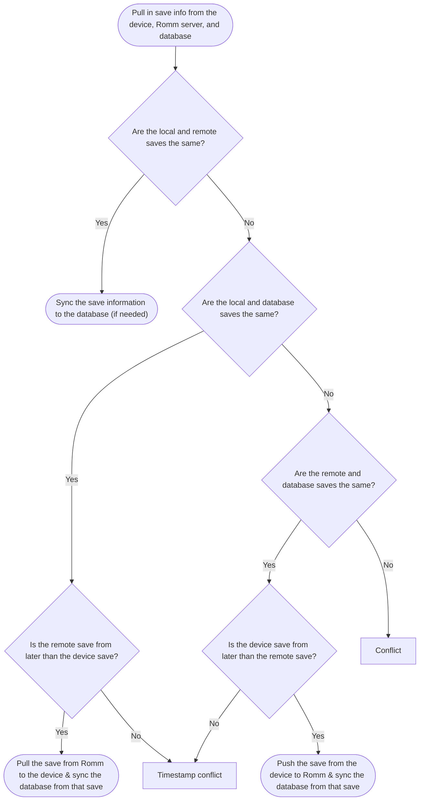

# Simple ROMM Syncer

An **IN PROGRESS** tool for syncing saves between the local device and a remote ROMM server.

## Progress

- [x] Romm integration
- [x] Syncing between local saves & Romm server
- [ ] Continous syncing in the background
- [ ] Desktop UI
- [ ] Miyoo Mini UI

## Sync logic

There are 3 separate repositories we want to keep in sync: 

* The local device's save file
* The remote Romm server's save file
* The local database containing the metadata on the last synced save file. 

We introduce the extra database so that we can make sure that any sync only
overwrite the save file we're expecting it it. It is to avoid a scenario where
you have 2+ devices attempting to sync to the same Romm server and for one
reason or another they each have progress that got saved, meaning one will get
uploaded before the other. Without the 3rd database, one of those new device
saves will end up overwriting the other (since one came later), even though we
aren't actually sure which is the one we want to use. In effect, the 3rd
repository allows us to accurately pick who is the "older" save.

The process for determining what action to take for a particular file the program follows this flowchart:

